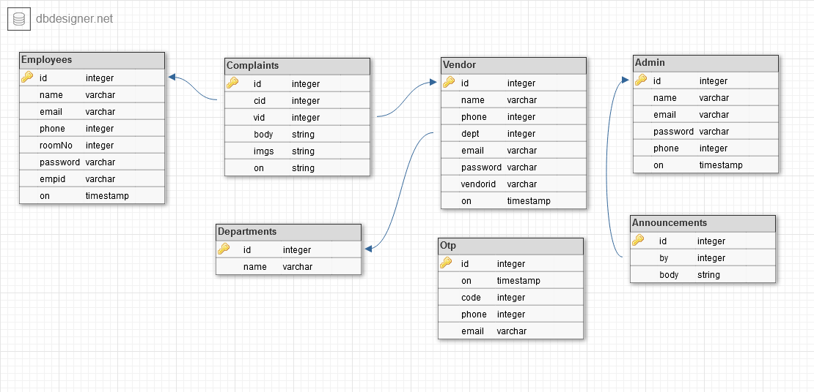

# CMS

This branch contains the backend code for the `CMS`

## Installation

- Pull the code from the branch (use `git pull origin backend`),
- Open cmd/terminal in the current dir(where you've pulled the code from this branch),
- On cmd/terminal type `pip install -r requirements.py`,
- Once done with the installation, make sure you have changed the variables in `globals.py` according to your db setup,
- Once everything is correctly setup run `python run.py setup`,
- After above script is done executing run `flask run --reload` or `python app.py`

And we are done, now run frontend code and they will be able to communicate with each other.

## Database Schema



## Folder Structure

- api,
- images,
- models,
- runScripts,
- utils,
- views,
- .gitignore,
- app.py,
- conn.py,
- db_schema.png,
- globals.py,
- requirements.txt,
- run.py

## Error

Below is the list of errors along with their respective codes
**Format :- "code": "message"**

```json
{
  "INVALID_PASSWORD": "Password invalid, please recheck your password",
  "NO_USER_FOUND": "No user with that email found",
  "USER_ALREADY_EXISTS": "A user with that email already exists",
  "UNABLE_TO_SEND_OTP": "Unable to send OTP please try again later",
  "UNABLE_TO_SEND_MSG": "Unable to send message to the user, please try again later",
  "INVALID_TOKEN": "User authentication expired",
  "INVALID_OTP": "OTP entered is invalid",
  "EXPIRED_OTP": "OTP is expired, try again",
  "INACTIVE_ACCOUNT": "Account is inactive, ask admin to activate",
  "INVALID_REQUEST": "Invalid request, try again with proper parameters",
  "NO_USER_FOUND_PHONE": "No user with that phone number found",
  "INVALID_FILE": "Whoops a file seems to be invalid :(",
  "SERVER_ERROR": "Some internal server error occured, try again later!",
  "UNAUTH_REQUEST": "Unauthorized Request",
  "NO_ANNOUNCEMENT_FOUND": "Unable to find any announcement :(",
  "MAX_REPOST_LIMIT_REACHED": "Hey looks like you already have reposted this complaint 2 times",
  "NO_COMPLAINT_FOUND": "No complaint found with that id",
  "INVALID_RIGHTS": "You don't have sufficient rights!",
  "NO_DEPARTMENT_FOUND": "No department with that id found! :(",
  "NO_VENDOR_FOUND": "No vendor with that id found! :(",
  "NO_EMPLOYEE_FOUND": "No employee with that id found! :(",
  "INVALID_PARAMS": "Invalid parameters :("
}
```

## Documentation

(W.I.P) Look for comments in each function. If you are using VSCode or any ide that supports intellisense, just hover over any function to see its description. Again it's a W.I.P thing so you might not see it on every function for now.
