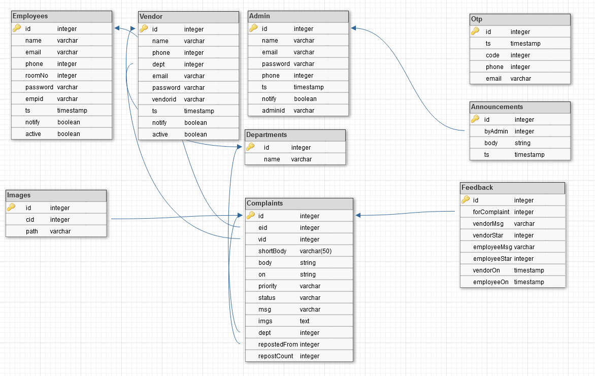

# CMS
This branch contains the backend code for the `CMS`

## Installation
- Pull the code from the branch (use `git pull origin backend`),
- Open cmd/terminal in the current dir(where you've pulled the code from this branch),
- On cmd/terminal type `pip install -r requirements.py`,
- Once done with the installation, make sure you have changed the variables in `globals.py` according to your db setup,
- Once everything is correctly setup run `python run.py setup`,
- After above script is done executing run `flask run --reload` or `python app.py`

And we are done, now run frontend code and they will be able to communicate with each other.

## Database Schema

## Folder Structure
- api,
- images,
- models,
- runScripts,
- utils,
- views,
- .gitignore,
- app.py,
- conn.py,
- db_schema.png,
- globals.py,
- requirements.txt,
- run.py

## Documentation
(W.I.P) Look for comments for each functions. If you are using VSCode or any ide that supports intellisense, just hover over any function to see its description. Again it's a W.I.P thing so you might not see it on every function for now.